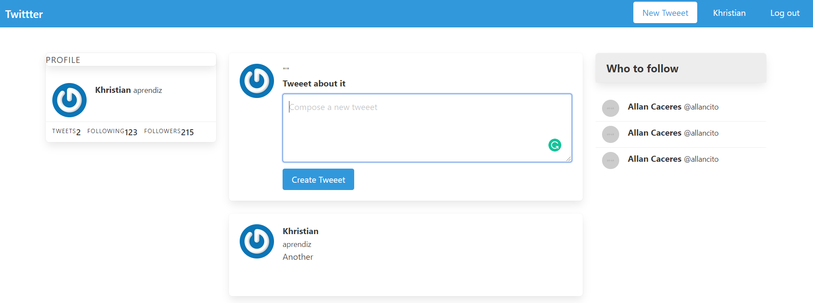
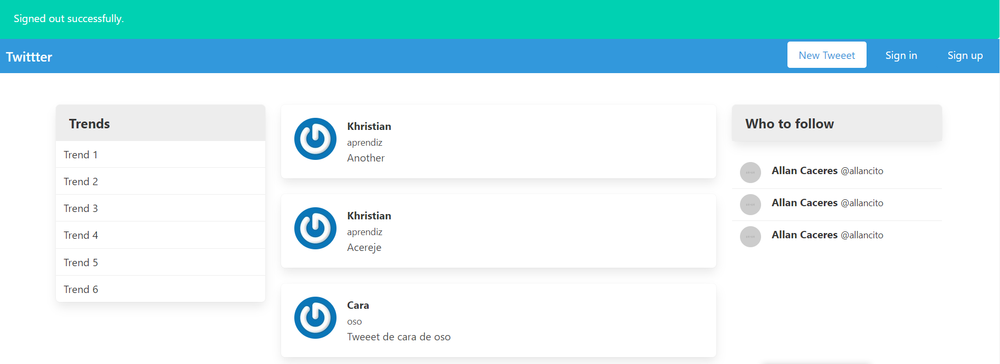

# Twitter Clone

> Made as a practice for authentication in rails using devise. It allows you to create new users, edit them, add posts and edit them. You only can see the email of the user who wrote the post if you are logged in.

## Built With

- Ruby
- Ruby on rails
- Devise

## Pre-requisites

- Ruby 2.7.0
- Rails gem
- Bundle

## How it works

- Clone the repository locally from [here](https://github.com/karmaester/re-former)
- Open re-former folder and run `Bundle install`
- Run `rails db:migrate`
- Run `rails server`
- Open your browser
- Type `http://localhost:3000/`

## How edit works

- Click on new Tweet
- You will be redirected to Sign up
- Create you user
- Start posting

## Authors

👤 **Khristian Rojas**

- Github: [@githubhandle](https://github.com/karmaester)
- Twitter: [@twitterhandle](https://twitter.com/karmaendlich)
- Linkedin: [linkedin](https://www.linkedin.com/in/khristian-rojas/)

## 🤝 Contributing

Contributions, issues and feature requests are welcome!

Feel free to check the [issues page](https://github.com/karmaester/Members-Only/issues).

## Show your support

Give a ⭐️ if you like this project!

## Acknowledgments

- The Odin Project
- Rails guides
- Microverse

## 📝 License

This project is [MIT](lic.url) licensed.
